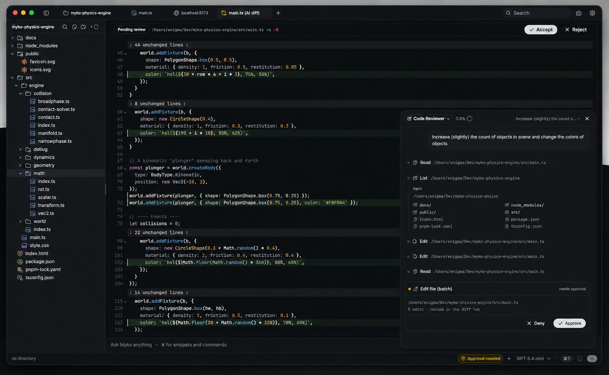
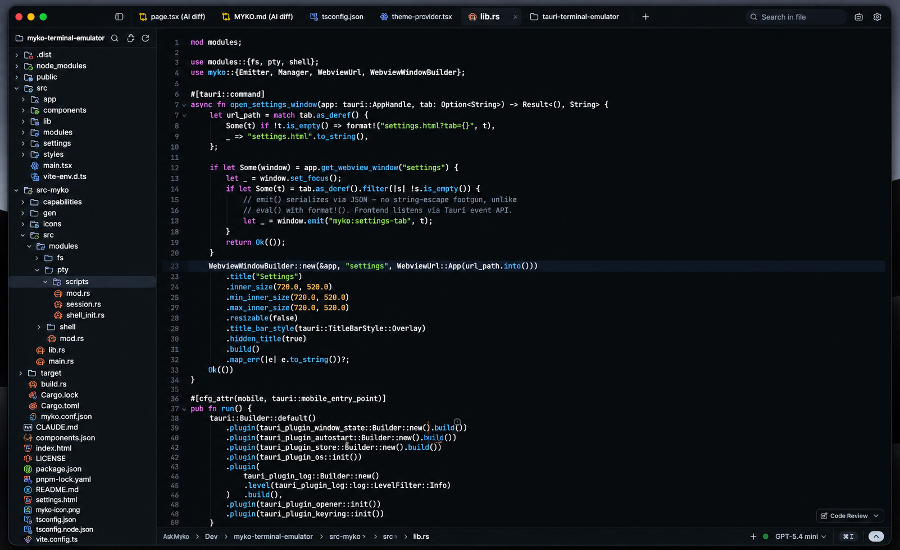
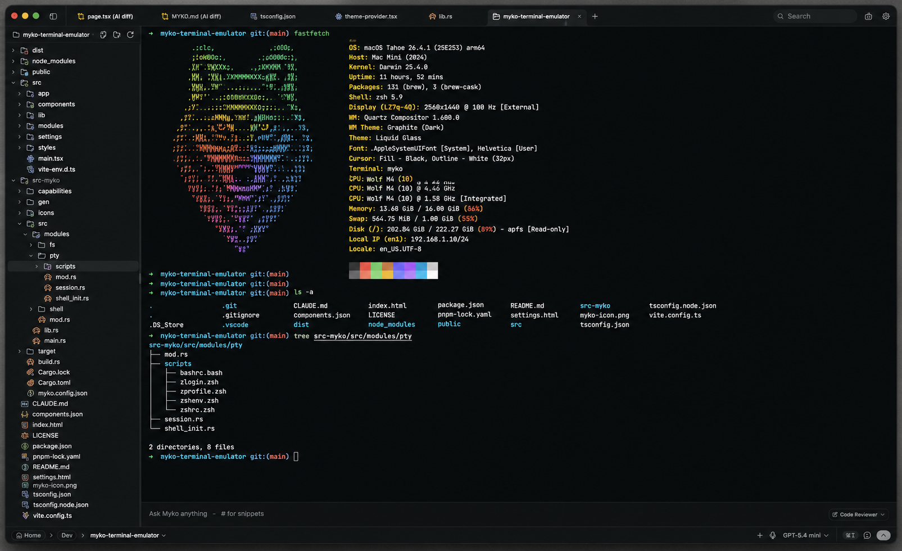
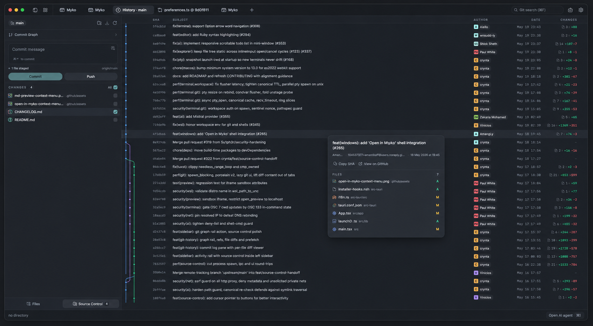
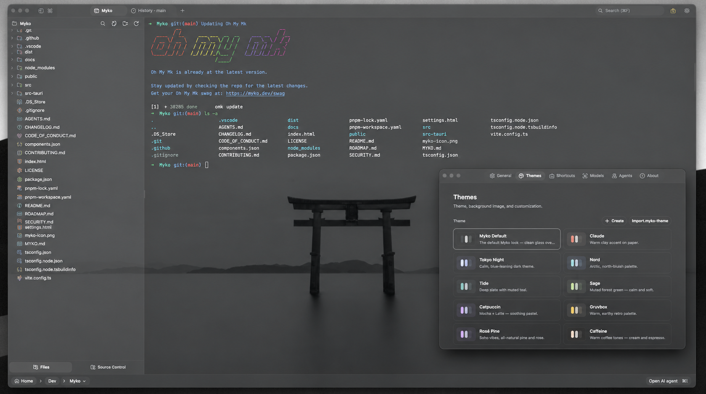
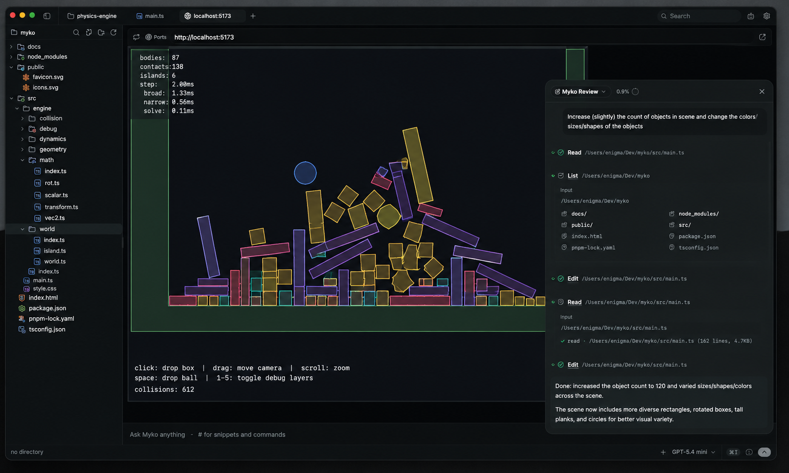

<div align="center">


# Myko

### The AI-native developer workspace.

**Terminal. Editor. Git. AI. Preview. One desktop workspace.**

Build, debug, review, and ship software without constantly switching between tools.

<br>

[](https://myko-beta.vercel.app/)
[](https://github.com/mustafa-lil-dev/myko-ai-terminal)
[](LICENSE)

</div>

---

## What is Myko?

Myko is a desktop development workspace built with **Tauri 2, Rust, React, and TypeScript**.

Instead of jumping between a terminal, editor, Git client, browser preview, and AI tools, Myko brings the core development workflow into one focused application.

```text
┌───────────────────────────────────────────────────────────────┐
│                           MYKO                                │
├──────────────┬──────────────────────────────┬───────────────┤
│              │                              │               │
│ File         │       Code Editor            │   AI          │
│ Explorer     │                              │   Workspace   │
│              │                              │               │
├──────────────┴──────────────────────────────┴───────────────┤
│                     Native Terminal                          │
├───────────────────────────────────────────────────────────────┤
│ Git • Preview • Processes • Tools                            │
└───────────────────────────────────────────────────────────────┘
```

Myko is designed around an **AI-first development workflow**, while keeping the traditional tools developers already rely on close at hand.

---

# Screenshots

Myko is designed to keep the entire development workflow inside one workspace.

## AI-native workflow

<table>
<tr>
<td width="50%" valign="top">

### AI Workflow



Plan, build, review, and iterate with AI directly inside your development workspace.

</td>

<td width="50%" valign="top">

### Code Editor



A focused CodeMirror-powered editor with syntax highlighting, diagnostics, Vim mode, AI completion, and AI-assisted edits.

</td>
</tr>
</table>

## Developer workspace

<table>
<tr>
<td width="50%" valign="top">

### Native Terminal



A native PTY terminal with tabs, splits, background processes, WebGL rendering, and multiple shell environments.

</td>

<td width="50%" valign="top">

### Source Control



Stage, commit, push, search history, and explore Git history through a visual commit graph.

</td>
</tr>
</table>

## Make it yours

<table>
<tr>
<td width="50%" valign="top">

### Themes



Customize the workspace with application themes, editor themes, backgrounds, opacity, blur, and keyboard shortcuts.

</td>

<td width="50%" valign="top">

### Web Preview



Detect local development servers and preview web applications directly inside Myko.

</td>
</tr>
</table>

---

# Why Myko?

Modern development often looks like this:

```text
Terminal
   ↓
Code Editor
   ↓
Git Client
   ↓
Browser
   ↓
AI Assistant
   ↓
Debugger
   ↓
Database Tool
   ↓
Back to Editor
```

Myko brings the workflow closer together:

```text
                    ┌───────────────┐
                    │      AI       │
                    └───────┬───────┘
                            │
┌────────────┐      ┌───────▼───────┐      ┌─────────────┐
│   Files    │──────│     MYKO      │──────│     Git     │
└────────────┘      │               │      └─────────────┘
                    │  Development  │
┌────────────┐      │   Workspace   │      ┌─────────────┐
│  Terminal  │──────│               │──────│ Web Preview │
└────────────┘      └───────┬───────┘      └─────────────┘
                            │
                    ┌───────▼───────┐
                    │    Editor     │
                    └───────────────┘
```

---

# Features

## ⚡ Native Terminal

Myko includes a native terminal powered by a real PTY backend.

* xterm.js rendering
* WebGL rendering
* Native PTY powered by `portable-pty`
* Multiple terminal tabs
* Horizontal and vertical splits
* Background processes
* Background output streaming
* Inline terminal search
* Link detection
* True-color output
* Terminal serialization
* Process management
* PowerShell
* PowerShell 7 / `pwsh`
* Command Prompt
* Bash
* Zsh
* Fish
* Windows local environment
* WSL environments

The terminal is not a simulated command console. It connects to the native operating-system environment.

---

# ✦ AI Workspace

Myko is built around an AI-native development workflow.

AI can work alongside your project rather than existing as a separate chat window.

### AI capabilities

* Composer
* File references with `@path`
* Reusable prompt snippets with `#handle`
* Slash commands
* Voice input where supported
* File attachments
* Editor-selection attachments
* Terminal-selection attachments
* `MYKO.md` project instructions and memory
* Plan mode
* Todo tracking
* Custom agents
* Sub-agents
* File reading
* File writing
* File editing
* Multi-file editing
* Grep
* Glob
* Terminal tool integration
* Command approval
* Background processes
* Streaming responses
* Reasoning display
* Tool status
* Notifications
* AI-generated edit diffs
* Reviewable changes before applying them

### Bring your own AI

Myko supports multiple cloud and local AI providers.

**Cloud providers**

* OpenAI
* Anthropic
* Google Gemini
* Groq
* xAI
* Cerebras
* OpenRouter
* DeepSeek
* Mistral
* OpenAI-compatible endpoints

**Local AI**

* LM Studio
* MLX
* Ollama

You choose the provider, endpoint, and model.

---

# 🧠 AI-assisted editing

AI-generated code changes can be reviewed before they are applied.

Instead of blindly replacing files, Myko can present changes as editable diffs.

```text
AI
 │
 ├── Understand project
 │
 ├── Plan changes
 │
 ├── Generate edits
 │
 ▼
Review Diff
 │
 ├── Accept
 ├── Reject
 └── Continue editing
```

This keeps the developer in control of changes.

---

# 💻 Code Editor

Myko includes a CodeMirror 6 editor.

### Editor features

* CodeMirror 6
* Multiple editor tabs
* Syntax highlighting
* Diagnostics
* Vim mode
* AI autocomplete
* AI-assisted edits
* Edit diffs
* Unsaved-change protection
* Multiple programming languages
* Independent editor themes

Supported languages include:

* TypeScript
* JavaScript
* JSX
* TSX
* Rust
* Python
* Go
* C
* C++
* Java
* PHP
* HTML
* CSS
* JSON
* Markdown
* Vue
* And other common formats

---

# 📁 File Explorer

Navigate your project without leaving Myko.

* Directory tree
* Fuzzy file search
* Keyboard navigation
* Inline rename
* File context actions
* Directory context actions
* Catppuccin file icons
* File attachments for AI
* Editor-selection attachments
* Terminal-selection attachments
* File watching
* Workspace-aware file changes

---

# Git & Source Control

Git is integrated directly into the development workspace.

### Git features

* Repository status
* Branch status
* Stage files
* Unstage files
* Stage individual hunks
* Unstage individual hunks
* Commit changes
* Push changes
* Upstream awareness
* Detached HEAD display
* Commit search
* Commit filtering
* Visual commit graph
* Merge lanes
* Open commits on the configured remote
* Native Git command handling
* Git error handling

Commit shortcuts:

```text
Windows / Linux
Ctrl + Enter

macOS
Cmd + Enter
```

---

# 🌐 Web Preview

Myko can detect local development servers and preview applications without forcing you to constantly switch to another window.

### Web preview features

* Local development server detection
* Local server preview
* External URL preview
* Native child webview support
* Adjustable preview layout
* Development workflow integration

Run your application and preview it from the same workspace.

---

# 🎨 Themes & Customization

Your development environment should feel like yours.

Myko supports:

* Built-in application themes
* Custom application themes
* Import/export custom themes
* Background images
* Adjustable background opacity
* Blur effects
* Independent editor themes
* Custom keyboard shortcuts
* Persistent window layout
* Persistent panel layout

---

# 🔐 Privacy & Security

Myko is designed to keep control in the developer's hands.

### API keys

Provider credentials are stored through the operating system's secure keychain.

They are **not stored in `localStorage`** and are not written into project files.

### AI permissions

AI tools can be configured with specific capabilities.

Potentially destructive operations such as shell commands can require approval depending on configuration.

### No required Myko account

Myko does not require users to create an application account.

### No application telemetry

Myko does not include application telemetry.

AI requests go to the provider or local endpoint configured by the user.

---

# 🖥️ Cross-platform

Myko is designed as a desktop application using Tauri 2.

### Windows

Supported with native Windows development environments and WSL.

### Linux

Build targets can produce:

* AppImage
* `.deb`
* `.rpm`

### macOS

Builds can target supported macOS architectures.

---

# 🚀 Installation

Installers are produced through the Tauri release build system.

## Windows

Run the Myko installer and launch the application.

If Windows SmartScreen displays a warning for an unsigned development build:

1. Select **More info**
2. Select **Run anyway**

WSL distributions can be used as workspace environments when installed.

---

## Linux

Depending on the build target, Myko can be distributed as:

```text
AppImage
.deb
.rpm
```

For AppImage systems without FUSE support:

```bash
./Myko_*.AppImage --appimage-extract-and-run
```

For some Wayland rendering issues:

```bash
WEBKIT_DISABLE_DMABUF_RENDERER=1 ./Myko_*.AppImage
```

---

## macOS

Use the generated macOS application bundle or disk image for the target architecture.

Myko's current build configuration targets macOS 13 or newer.

---

# 🤖 Configure AI

After installing Myko:

1. Open **Settings → AI**
2. Select your provider
3. Enter your API key or local endpoint
4. Select a model
5. Save the configuration
6. Open the AI workspace

For local AI, start your local provider first.

Supported local environments include:

```text
LM Studio
MLX
Ollama
```

---

# 🛠️ Build From Source

## Requirements

You will need:

* Node.js 24+
* pnpm 10+
* Rust stable
* Tauri 2 prerequisites
* WebView2 on Windows
* Git

## Clone

```bash
git clone https://github.com/mustafa-lil-dev/myko-ai-terminal.git
cd myko-ai-terminal
```

## Install dependencies

```bash
pnpm install
```

## Start the frontend

```bash
pnpm dev
```

The Vite development server runs at:

```text
http://localhost:1420
```

For native Tauri functionality, use:

```bash
pnpm tauri dev
```

---

# 📦 Build Myko

Build the frontend:

```bash
pnpm build
```

Build the desktop application:

```bash
pnpm tauri build
```

### Windows NSIS installer

```bash
pnpm tauri build --bundles nsis
```

### Windows MSI installer

```bash
pnpm tauri build --bundles msi
```

Build output is generated under:

```text
src-tauri/target/release/bundle/
```

Typical Windows outputs include:

```text
src-tauri/target/release/bundle/nsis/Myko_0.8.5_x64-setup.exe
src-tauri/target/release/bundle/msi/Myko_0.8.5_x64_en-US.msi
```

---

# 🧪 Development & Quality Checks

Run type checking:

```bash
pnpm check-types
```

Check formatting:

```bash
pnpm format:check
```

Run linting:

```bash
pnpm lint
```

Run tests:

```bash
pnpm test
```

Other useful commands:

```bash
pnpm format
pnpm lint:fix
pnpm test:watch
pnpm preview
pnpm analyze:bundle
pnpm analyze:eager
pnpm size
pnpm knip
```

Rust checks:

```bash
cd src-tauri
cargo check
cargo test
```

---

# 🏗️ Architecture

Myko uses a desktop architecture built around a web-based interface and native Rust capabilities.

```text
┌──────────────────────────────────────┐
│            React + TypeScript        │
│                                      │
│ UI • Editor • AI • Workspace • Git   │
└──────────────────┬───────────────────┘
                   │
                   │ Tauri IPC
                   ▼
┌──────────────────────────────────────┐
│                Rust                  │
│                                      │
│ PTY • Filesystem • Git • Processes   │
│ Networking • Secrets • SSH • LSP     │
│ Workspace • Native Agent Operations  │
└──────────────────────────────────────┘
```

### Main technologies

| Layer             | Technology             |
| ----------------- | ---------------------- |
| Desktop framework | Tauri 2                |
| Frontend          | React 19               |
| Language          | TypeScript             |
| Native backend    | Rust                   |
| Build tool        | Vite                   |
| Package manager   | pnpm                   |
| Editor            | CodeMirror 6           |
| Terminal          | xterm.js               |
| State             | Zustand                |
| AI                | Vercel AI SDK          |
| Styling           | Tailwind CSS           |
| UI                | Radix-based components |

---

# 📂 Project Structure

```text
myko-ai-terminal/
├── .github/
├── docs/
├── public/
├── scripts/
├── src/
│   ├── ...
├── src-tauri/
│   ├── ...
├── LICENSE
├── README.md
├── SECURITY.md
├── CONTRIBUTING.md
├── package.json
├── pnpm-lock.yaml
├── tsconfig.json
├── vite.config.ts
└── myko-icon.png
```

Documentation and architecture notes are kept inside the `docs/` directory.

---

# 📸 Documentation Screenshots

Current product screenshots are stored in:

```text
docs/
├── ai-workflow.png
├── editor.png
├── source-control.png
├── terminal.png
├── themes.png
└── web-preview.png
```

These screenshots are also used as part of Myko's product documentation and presentation.

---

# 🗺️ Roadmap

Myko is actively evolving.

Areas of development include:

* More powerful AI workflows
* Improved agent orchestration
* Better debugging workflows
* Deeper development tooling
* More workspace integrations
* Improved GitHub workflows
* Additional database tooling
* Docker workflows
* API development workflows
* SSH workflows
* Improved project setup and health checks
* More customization
* Performance improvements
* Better cross-platform support

The roadmap may change as Myko develops.

---

# 🤝 Contributing

Contributions, bug reports, ideas, and improvements are welcome.

Before contributing, please read:

* [`CONTRIBUTING.md`](CONTRIBUTING.md)
* [`CODE_OF_CONDUCT.md`](CODE_OF_CONDUCT.md)
* [`SECURITY.md`](SECURITY.md)

If you find a bug, please provide enough information to reproduce it.

---

# 🔒 Security

If you discover a security vulnerability, please follow the instructions in:

[`SECURITY.md`](SECURITY.md)

Please avoid publicly disclosing sensitive security issues before they can be investigated.

---

# 📄 License

Myko is licensed under the **GNU General Public License v3.0**.

See [`LICENSE`](LICENSE) for the complete license text.

---

# 🔗 Links

**Website**

https://myko-beta.vercel.app/

**GitHub**

https://github.com/mustafa-lil-dev/myko-ai-terminal

**Website Source**

https://github.com/mustafa-lil-dev/myko-ai-website

---

<div align="center">

## Build without leaving your flow.

### Myko

**Your development workspace, built around AI.**

<br>

Made with Rust, React, TypeScript, and a lot of coffee.

</div>
